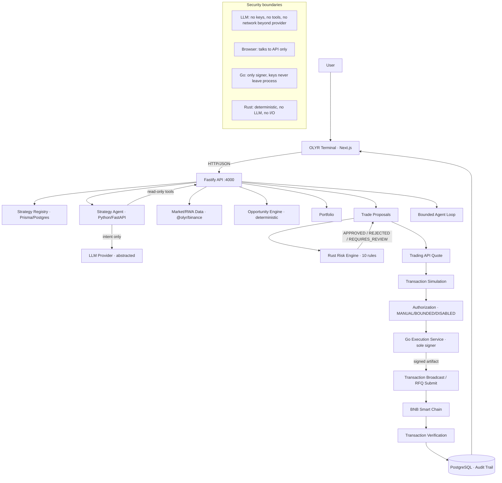

# Final Architecture

## Mermaid diagram

## Trust boundaries

1. **Browser → API**: the only public surface. Credentials never cross it.
2. **API → Rust**: proposals are evaluated; the Rust engine is deterministic,
   stateless, and LLM-free.
3. **API → Go**: signed internal-token contract; Go verifies the full
   chain-of-custody bundle before signing.
4. **Agent → LLM**: raw text in, raw JSON out; everything after is
   deterministic validation.
5. **Everything → BSC**: settlement happens only through the gated pipeline.

## Component responsibilities (verified)

| Component   | Responsibility                        | Never does                                      |
| ----------- | ------------------------------------- | ----------------------------------------------- |
| Terminal    | render real state                     | fabricate data, reach backend services directly |
| Fastify API | orchestrate, validate, persist        | sign transactions                               |
| Agent       | interpret intent                      | execute, hold keys, mutate policy               |
| Risk engine | approve/reject deterministically      | touch network, LLM, or state                    |
| Go service  | verify gates, sign, broadcast, verify | accept arbitrary transactions                   |
| PostgreSQL  | persist state + audit                 | hold secrets                                    |

## Phase history

P1 foundation · P2 Binance RWA data · P3 market intelligence · P4 strategy
agent · P5 risk engine + proposals · P6 quotes/simulation/controlled
execution · P7 Agentic Wallet + bounded loop · P8 terminal UI · P9
hardening + mainnet readiness · P10 final release.
