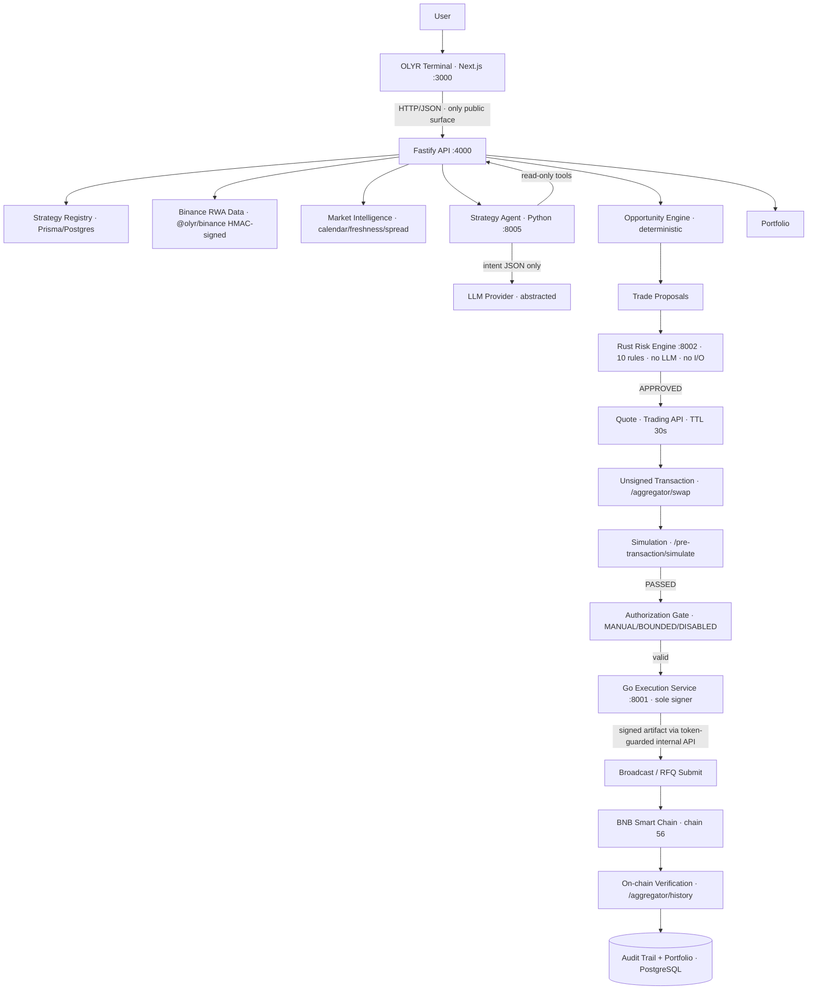

# OLYR Final Architecture (v1.0.0)

## Trust boundaries (marked)

| Boundary                | Enforcement                                                                                                                                                                         |
| ----------------------- | ----------------------------------------------------------------------------------------------------------------------------------------------------------------------------------- |
| **AI boundary**         | The agent emits one validated JSON document. No tools, no keys, no network beyond the LLM provider. Validators reject anything oversized, unsupported, or injected.                 |
| **Risk boundary**       | Only the Rust engine approves execution — 10 deterministic rules, no LLM, no I/O, no state.                                                                                         |
| **Wallet boundary**     | Only the Go service holds the executor key; it re-verifies the full chain-of-custody bundle (proposal/quote/simulation/authorization) before signing, and re-checks chain identity. |
| **Blockchain boundary** | Broadcast requires every prior gate; broadcast ≠ confirmed — on-chain verification is a separate, mandatory step.                                                                   |

## Service inventory (verified)

| Service     | Port | Stack              | Responsibility                                                                     |
| ----------- | ---- | ------------------ | ---------------------------------------------------------------------------------- |
| Terminal    | 3000 | Next.js 16         | Real-state UI, honest empty/error states                                           |
| API         | 4000 | Fastify 5 + Prisma | All routes, validation, persistence, orchestration                                 |
| Agent       | 8005 | Python/FastAPI     | Intent interpretation, 4-layer validation, read-only tools                         |
| Risk engine | 8002 | Rust/axum          | Deterministic execution authority                                                  |
| Execution   | 8001 | Go + go-ethereum   | Sole signer, state machine, idempotency                                            |
| PostgreSQL  | 5432 | Prisma 6           | Registry, proposals, quotes, simulations, authorizations, executions, audit events |
